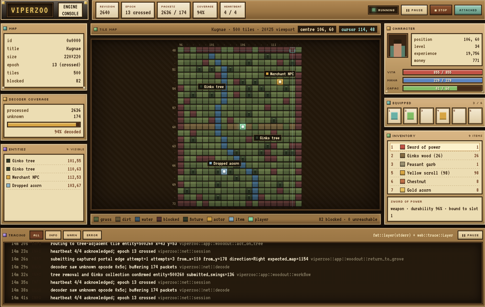

<p align="center">
  
</p>

`VIPERZOO` is a homage to someone whose creative output around a classic online
RPG made a deep impression on me when I was younger.

It is my own spin on his defining contribution: A research project on the
same game, built on a reverse-engineered protocol and a deterministic engine.



## Quick start

For a new application under `apps/`, add the SDK and the adapter that supplies
its observations and actions:

```toml
[dependencies]
tokio = { workspace = true, features = ["macros", "rt-multi-thread"] }
viperzoo-adapter-frida = { path = "../../crates/adapter-frida" }
viperzoo-sdk = { path = "../../crates/sdk" }
```

The SDK owns the canonical engine, adapter, event handler, and any selected
diagnostic console as one lifecycle. A started session exposes only the
facilities an application uses: semantic actions, the coherent world, static
assets, active adapter capabilities, and direct lifecycle methods.

```rust
use viperzoo_adapter_frida as frida;
use std::time::Duration;
use viperzoo_sdk::{adapter::action::Action, session, world::query};

#[tokio::main]
async fn main() -> Result<(), Box<dyn std::error::Error>> {
    let adapter = frida::Adapter::new(frida::Config::new(frida::Target::process(
        "NexusTK.exe",
    )));
    let session = session()
        .adapter(adapter)
        .on_event(|event| eprintln!("{event:?}"))
        .start()
        .await?;

    let position = session
        .world()
        .wait(query::position::known())
        .run()
        .await?;

    println!(
        "localized at {}, {}",
        position.value().x().value(),
        position.value().y().value()
    );

    let refreshed = session
        .actions()
        .perform(Action::RefreshMap)
        .confirm(query::position::known())
        .within(Duration::from_secs(2))
        .run()
        .await?;

    println!("refresh confirmed at revision {}", refreshed.evidence().revision().value());
    let report = session.shutdown().await?;
    println!("stopped at revision {}", report.revision().value());

    Ok(())
}
```

`perform` is lazy until `run` is awaited. `confirm` captures a pre-dispatch
revision fence and returns both the adapter's typed dispatch receipt and dated
canonical-world evidence. `on_event` receives the adapter's closed, typed event
vocabulary; applications that need the stream directly can omit it, while
applications that intentionally do not use diagnostics can select
`.discard_events()`.

Optional facilities stay on the same fluent surface. Add `.load_assets()?` to
make the installed collision catalog available through `session.assets()`, or
add `.diagnostics(viperzoo_sdk::diagnostics::Console::new(address))` to make the
browser console part of the session's coordinated shutdown. Adapter-specific
configuration, such as Frida recording, remains on that adapter; inspect the
resulting closed vocabulary with `session.capabilities()`.

## Workspace

### Crates

- `viperzoo-protocol` — Plaintext client and server protocol bodies.
- `viperzoo-capture` — Typed ingestion of research-tap records.
- `viperzoo-adapter-api` — Transport-neutral observations and actions.
- `viperzoo-engine` — Deterministic world-state reduction and runtime ownership.
- `viperzoo-adapter-frida` — Live client integration through Frida.
- `viperzoo-assets` — Client tile and object data.
- `viperzoo-navigation` — Deterministic path planning.
- `viperzoo-actions` — Reusable asynchronous action policies.
- `viperzoo-world` — Immutable world snapshots.
- `viperzoo-sdk` — The script-facing crate bundle.

### Applications

The repo contains dummy implementations demonstrating how to utilize the protocol as an author

- `viperzoo` — Attaches to and drives a live client.
- `viperzoo-live` — Follows a live observation stream.
- `viperzoo-replay` — Replays observations into a final world snapshot.
- `viperzoo-walk` — Walks to a coordinate on the current map.

## Commands

```powershell
cargo +nightly fmt --all --
cargo ci-clippy
cargo test --workspace

cargo run -p viperzoo
cargo run -p viperzoo-walk -- 10 1
```
